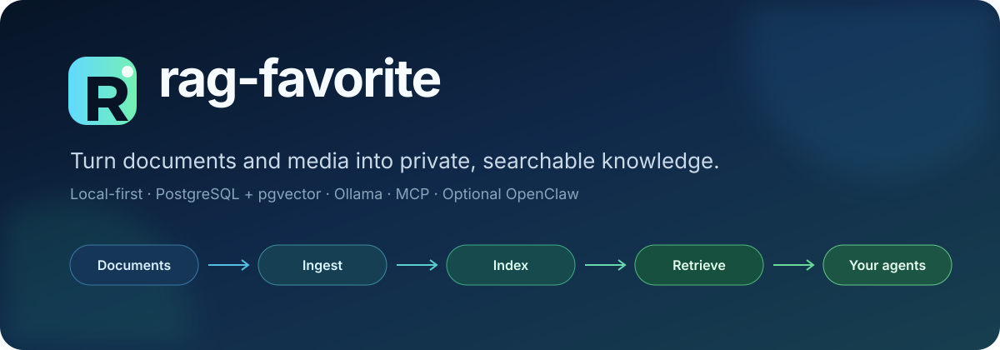
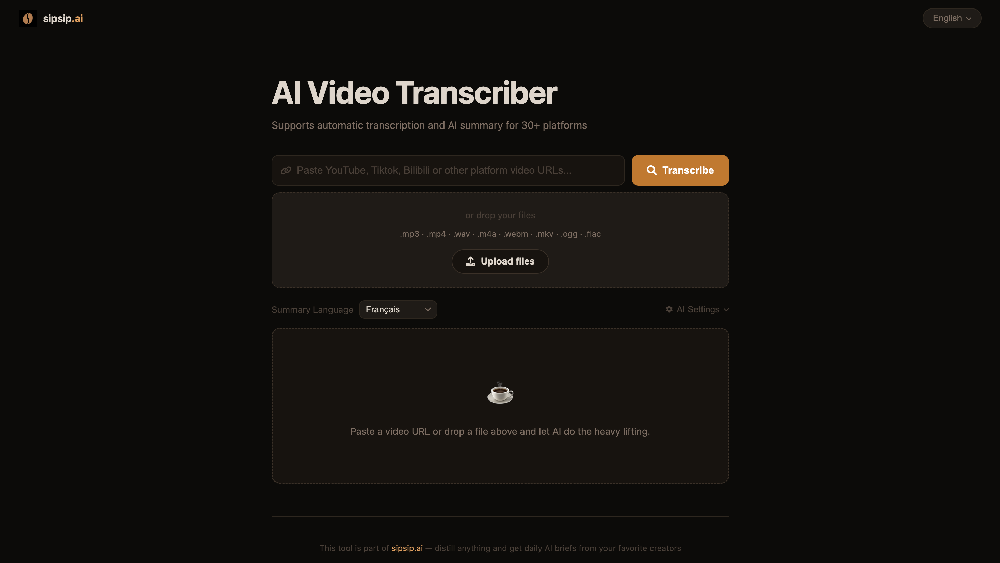
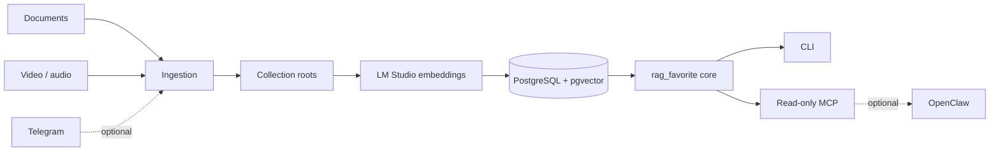

<div align="center">
  
</div>

<div align="center">
  <br />
  <a href="https://github.com/tzuo5/rag_favorite/actions/workflows/ci.yml"></a>
  <a href="https://github.com/tzuo5/rag_favorite/releases"></a>
  <a href="https://www.python.org/"></a>
  <a href="LICENSE"></a>
  <a href="https://modelcontextprotocol.io/"></a>
</div>

<p align="center">
  <strong>Your media. Your documents. Your searchable knowledge.</strong><br />
  A local-first RAG pipeline with PostgreSQL + pgvector, LM Studio embeddings,<br />
  a standard MCP server, and an optional OpenClaw bridge.
</p>

<p align="center">
  <a href="#quick-start">Quick start</a> ·
  <a href="#what-you-get">Features</a> ·
  <a href="#architecture">Architecture</a> ·
  <a href="README_ZH.md">中文文档</a>
</p>

---

## Why rag-favorite?

Useful knowledge is scattered across notes, videos, audio, and chat. rag-favorite
turns those sources into one private retrieval layer that your terminal, MCP
clients, or an existing OpenClaw installation can query. The core runs without
OpenClaw and does not require a hosted vector database or embedding API.

## What you get

| Capability | What it does |
| --- | --- |
| **Document RAG** | Index Markdown and text collections with deterministic, collection-aware retrieval. |
| **Media ingestion** | Download, transcribe, enrich, and file video/audio from YouTube, Bilibili, and Xiaohongshu workflows. |
| **Local embeddings** | Use LM Studio locally and store vectors in PostgreSQL + pgvector. |
| **Standard MCP** | Expose `rag_search` and `rag_status` through a read-only stdio server. |
| **OpenClaw adapter** | Detect, plan, install, probe, back up, roll back, and remove an optional local registration. |
| **Ingestion lifecycle** | Safely prepare media workers and optionally register the Telegram adapter with OpenClaw. |
| **Native macOS release** | Download tested Apple Silicon or Intel bundles with isolated Python and launchd workers. |
| **Safe first run** | Preview an idempotent setup, validate configuration, and start isolated services without `sudo`. |

### Designed for trust

- **Local by default** — product mode accepts loopback PostgreSQL and LM Studio
  endpoints; no hosted service is required.
- **Read-only agent boundary** — the packaged MCP surface cannot mutate the
  knowledge base.
- **Guarded integration** — OpenClaw changes are checksummed, backed up, probed,
  and rolled back on failure.
- **Portable configuration** — XDG paths, environment overrides, and named
  collections replace machine-specific constants.

## Quick start

### macOS download

Download the matching Apple Silicon or Intel archive from the
[latest Release](https://github.com/tzuo5/rag_favorite/releases/latest), verify
its `.sha256` file, then right-click `install.command` and choose **Open**.

```bash
uname -m  # arm64 or x86_64
./install.command
export PATH="$HOME/.local/bin:$PATH"
rag-favorite --version
```

The bundle provisions an isolated Python environment and the complete media
stack. FFmpeg, PostgreSQL + pgvector, LM Studio, and optional OpenClaw remain
operator-controlled external services. See the [macOS guide](docs/macos.md).

### Source install

#### 1. Install

Requirements: Python 3.11+, Docker with Compose (or existing PostgreSQL),
LM Studio/llmster, and enough disk space for the selected embedding model.

```bash
git clone https://github.com/tzuo5/rag_favorite.git
cd rag_favorite

python3 -m venv .venv
source .venv/bin/activate
python -m pip install --upgrade pip
python -m pip install -e ".[mcp]"
```

#### 2. Preview, then apply setup

Download/import Qwen3-Embedding-0.6B in LM Studio first, then load it and start
the local server. With the model already available, the CLI commands are:

```bash
lms load text-embedding-qwen3-embedding-0.6b --gpu off --context-length 4096
lms server start --bind 127.0.0.1 --port 1234
```

```bash
rag-favorite setup plan
rag-favorite setup apply --start-services
rag-favorite embedding inspect
rag-favorite config path
```

Copy the returned GGUF `model_digest` into `[embedding].model_digest` in the config
file shown by `config path`, then run `rag-favorite setup status`. A new config
reports `model-unpinned` until this step is complete; embeddings require the
installed weights to match that digest. Local requests never fall back to a
hosted embedding service.

Setup creates an owner-only credential file and the following portable layout:

```text
~/.config/rag-favorite/config.toml
~/.config/rag-favorite/secrets.env
~/.local/share/rag-favorite/knowledge/
~/.cache/rag-favorite/
~/.local/state/rag-favorite/
```

Setup manages PostgreSQL; LM Studio is started separately. Ollama remains an
explicit compatibility provider. See the [LM Studio guide](docs/implementation/lmstudio-provider.md).
For local ImageBind, asynchronous video import, deletion of owned originals, and
the five-tool Codex MCP, see the [VideoRAG implementation record](docs/implementation/videorag-phases-0-6.md).
Telegram is cancelled in this development scope; ordinary text RAG remains compatible.
Already running PostgreSQL on loopback? Omit `--start-services`. For
an offline filesystem-only bootstrap, use `--skip-database`.

#### 3. Ingest and search

```bash
rag-favorite ingest ~/Documents/research --collection general
rag-favorite search "What were the key deployment decisions?" --collection general
rag-favorite status --collection general
```

Collections live in the configuration file, so you can add or replace them
without changing Python code:

```toml
[[collections]]
key = "research"
name = "Research Notes"
path = "~/Documents/research"
```

To rebuild without replacing the active index, use `rag-favorite index
create/build/activate/list`. The [local text Phase 1 record](docs/implementation/videorag-phase-1.md)
documents the verified generation workflow, rollback, and isolated Linux MVP.
The [VideoRAG Dev Doc](docs/videorag-dev.md) tracks the later video, remote MCP,
and independent Telegram work.

## Connect your tools

### Any MCP client

```bash
rag-favorite mcp inspect
rag-favorite mcp smoke
rag-favorite mcp config
```

The generated configuration launches `rag-favorite-mcp` over stdio. There is no
new network listener, and only `rag_search` and `rag_status` are exposed. See the
[MCP guide](docs/phase-3-standard-mcp.md).

### OpenClaw (optional)

OpenClaw is not bundled or installed by this repository. If it already exists
on the machine, register the same MCP server with a previewable workflow:

```bash
rag-favorite openclaw detect
rag-favorite openclaw plan
rag-favorite openclaw install
rag-favorite openclaw status --probe
```

Unmanaged name collisions fail closed. Every mutation gets an owner-only,
checksummed backup; failed probes restore the exact previous configuration. The
integration never changes OpenClaw gateway, channel, Telegram, or agent policy.
See the [OpenClaw integration guide](docs/phase-4-openclaw-integration.md).

### Telegram and media ingestion (optional)

The ingestion service provides video/audio processing, author discovery,
session management, batch confirmation, and an optional OpenClaw Telegram
plugin. Preview the portable Phase 5 lifecycle before installing anything:

```bash
rag-favorite ingestion detect
rag-favorite ingestion plan --install-dependencies --render-systemd --with-openclaw
rag-favorite ingestion install --install-dependencies --render-systemd --with-openclaw
rag-favorite ingestion status --with-openclaw
```

On macOS, replace `--render-systemd` with `--render-launchd`.

Dependency installation, service activation, and OpenClaw registration are
separate explicit gates. Start with the
[Phase 5 lifecycle guide](docs/phase-5-ingestion-lifecycle.md), the
[English ingestion guide](ingestion/README.md), or the
[中文接入指南](ingestion/README_ZH.md).

<details>
<summary><strong>See the media ingestion interface</strong></summary>
<br />
<div align="center">
  
</div>
</details>

## Architecture



The portable `rag_favorite` package owns configuration, migrations, indexing,
and retrieval. Media ingestion and legacy compatibility services sit around
that core rather than changing its contract.

<details>
<summary><strong>Repository map</strong></summary>

| Path | Purpose |
| --- | --- |
| `src/rag_favorite/` | Installable product core, setup CLI, MCP server, and OpenClaw lifecycle. |
| `ingestion/` | Video/audio ingestion, author discovery, sessions, Telegram plugin, and UI. |
| `migrations/core/` | Canonical portable database migration. |
| `services/rag-postgres/` | Local pgvector Compose service. |
| `services/ollama/` | Local Ollama Compose service. |
| `services/rag-mcp/` | Legacy MCP and governed-memory compatibility. |
| `services/cooking-rag/` | Optional structured recipe compatibility extension. |
| `docs/` | Setup, MCP, OpenClaw, and product design notes. |

</details>

## Commands at a glance

```text
rag-favorite setup {plan,apply,status}
rag-favorite config {init,path,validate}
rag-favorite collection list
rag-favorite init | doctor | ingest | search | status
rag-favorite mcp {inspect,smoke,config}
rag-favorite openclaw {detect,plan,install,status,backups,restore,uninstall}
rag-favorite ingestion {detect,plan,install,status,uninstall}
```

Run `rag-favorite <command> --help` for all options.

## Documentation

- [Portable product core](docs/phase-1-product-core.md)
- [First-run setup](docs/phase-2-first-run-setup.md)
- [Standard MCP server](docs/phase-3-standard-mcp.md)
- [Guarded OpenClaw integration](docs/phase-4-openclaw-integration.md)
- [Portable media ingestion lifecycle](docs/phase-5-ingestion-lifecycle.md)
- [macOS release and launchd setup](docs/macos.md)
- [Media ingestion deployment](ingestion/docs/DEPLOYMENT.md)
- [Security policy](SECURITY.md)
- [Contributing guide](CONTRIBUTING.md)
- [Changelog](CHANGELOG.md)

## Development

```bash
python -m pip install -e ".[mcp,ingestion,dev]"
make check
```

`make check` runs formatting/lint checks, package tests, ingestion tests, legacy
compatibility suites, Node plugin tests, compile checks, and a wheel build. See
[CONTRIBUTING.md](CONTRIBUTING.md) for focused commands and pull-request policy.

## Project status

`v1.2.0` adds downloadable, architecture-tested macOS releases and native
launchd workers to the stable local-first product. The CLI, database migration,
read-only MCP contract, and guarded OpenClaw registration are considered public
interfaces. The ingestion integrations depend on upstream platform behavior and
are maintained as optional adapters.

## Security and privacy

Never commit Telegram tokens, database passwords, cookies, browser profiles,
database dumps, personal documents, or generated OpenClaw state. Please report
security issues privately as described in [SECURITY.md](SECURITY.md).

## License

Apache-2.0 © rag-favorite contributors. See [LICENSE](LICENSE).


## Followed Xiaohongshu creators

`bash examples/video_runtime.sh cli import-following` discovers the current account's
followed creators and backfills accessible video and image notes into the existing
queue. Discovery uses an exact following-count check, durable author cursors, shared
source deduplication and queue backpressure. Image notes support local OCR and optional
vision with image evidence. Daily synchronization and continuation are available through
`bash examples/video_runtime.sh following-schedule`.

See the [usage and acceptance notes](docs/implementation/xhs-following-ingestion.md)
and [research and defaults](docs/research/xhs-following-ingestion.md). Discovery and
media processing have separate completion states; platform access limits remain explicit.
