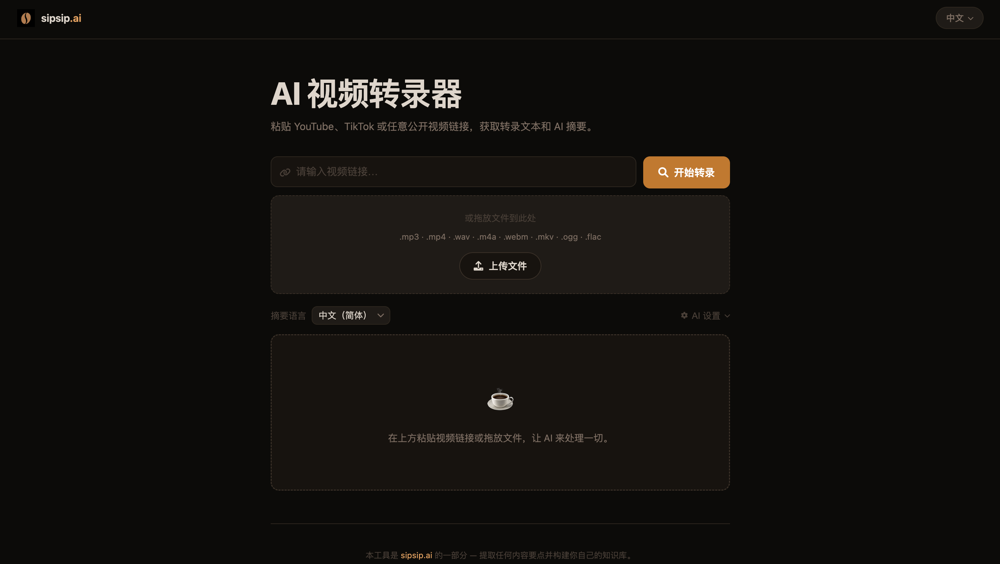
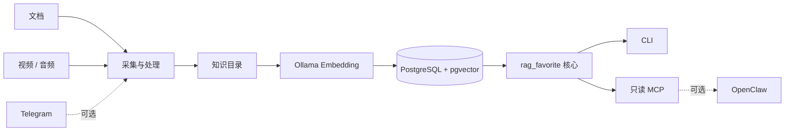

<div align="center">
  
</div>

<div align="center">
  <br />
  <a href="https://github.com/tzuo5/rag_favorite/actions/workflows/ci.yml"></a>
  <a href="https://github.com/tzuo5/rag_favorite/releases"></a>
  <a href="https://www.python.org/"></a>
  <a href="LICENSE"></a>
  <a href="https://modelcontextprotocol.io/"></a>
</div>

<p align="center">
  <strong>把你收藏的文档、视频和音频，变成真正可检索的私人知识库。</strong><br />
  PostgreSQL + pgvector、Ollama、本地 MCP，以及可选的 OpenClaw 接入。
</p>

<p align="center">
  <a href="#快速开始">快速开始</a> ·
  <a href="#核心能力">核心能力</a> ·
  <a href="#系统架构">系统架构</a> ·
  <a href="README.md">English</a>
</p>

---

## 为什么做 rag-favorite？

真正有价值的信息往往散落在笔记、长视频、音频和聊天记录里。
rag-favorite 将这些内容统一整理成一个本地优先的检索层，可以从 CLI、
任意 MCP 客户端，或者你电脑上已有的 OpenClaw 访问。核心功能不依赖
OpenClaw，也不要求购买托管向量数据库或 embedding API。

## 核心能力

| 能力 | 说明 |
| --- | --- |
| **文档 RAG** | 按 collection 索引 Markdown/文本，并进行稳定、可追溯的检索。 |
| **媒体采集** | 支持 YouTube、哔哩哔哩、小红书工作流中的下载、转写、加工与归档。 |
| **本地 Embedding** | 使用 Ollama 生成向量，写入 PostgreSQL + pgvector。 |
| **标准 MCP** | 通过 stdio 提供只读的 `rag_search` 和 `rag_status`。 |
| **OpenClaw 适配** | 支持检测、预览、安装、探测、备份、回滚和卸载。 |
| **采集生命周期** | 安全准备媒体 worker，并可选地向 OpenClaw 注册 Telegram adapter。 |
| **原生 macOS 发行包** | 提供经过真机 Runner 验证的 Apple Silicon/Intel 包和 launchd worker。 |
| **安全初始化** | 首次运行可先 plan，再幂等 apply；不会调用 `sudo`。 |

默认安全边界：只接受 loopback PostgreSQL/Ollama；MCP 只读；OpenClaw
修改前自动创建仅所有者可读的校验备份，探测失败会恢复原始配置。

## 快速开始

### macOS 下载版

从 [最新 Release](https://github.com/tzuo5/rag_favorite/releases/latest) 下载
与你的 Mac 匹配的 Apple Silicon 或 Intel 压缩包，校验 `.sha256` 后，右键
`install.command` 并选择“打开”：

```bash
uname -m  # arm64 或 x86_64
./install.command
export PATH="$HOME/.local/bin:$PATH"
rag-favorite --version
```

发行包会自动准备隔离 Python 环境和完整媒体依赖；FFmpeg、PostgreSQL +
pgvector、Ollama 与可选 OpenClaw 仍由使用者控制。详见
[macOS 安装文档](docs/macos.md)。

### 源码安装

需要 Python 3.11+、Docker Compose，以及足够存放 Ollama 模型的磁盘空间。

```bash
git clone https://github.com/tzuo5/rag_favorite.git
cd rag_favorite

python3 -m venv .venv
source .venv/bin/activate
python -m pip install --upgrade pip
python -m pip install -e ".[mcp]"
```

先查看安装计划，再执行：

```bash
rag-favorite setup plan
rag-favorite setup apply --start-services --pull-model
rag-favorite setup status
```

已有本机 PostgreSQL 和 Ollama 时可以省略 `--start-services`。仅初始化文件、
暂不连接数据库时使用 `--skip-database`。

导入并检索内容：

```bash
rag-favorite ingest ~/Documents/research --collection general
rag-favorite search "部署方案最终如何决定？" --collection general
rag-favorite status --collection general
```

Collection 完全由配置驱动，无需修改 Python 代码：

```toml
[[collections]]
key = "research"
name = "研究资料"
path = "~/Documents/research"
```

## 接入 MCP

```bash
rag-favorite mcp inspect
rag-favorite mcp smoke
rag-favorite mcp config
```

生成的配置通过 stdio 启动 `rag-favorite-mcp`，不会开放新的网络端口。详细
说明见 [MCP 接入文档](docs/phase-3-standard-mcp.md)。

## 接入 OpenClaw（可选）

本仓库不包含、也不会替你安装 OpenClaw。如果电脑上已经完成 OpenClaw
onboarding，可以安全地注册同一个本地 MCP server：

```bash
rag-favorite openclaw detect
rag-favorite openclaw plan
rag-favorite openclaw install
rag-favorite openclaw status --probe
```

该流程不会修改 OpenClaw 的 gateway、channel、Telegram 或 agent 权限。
完整的备份、冲突、回滚和卸载规则见
[OpenClaw 集成文档](docs/phase-4-openclaw-integration.md)。

## Telegram 与视频采集（可选）

`ingestion/` 提供视频/音频处理、作者发现、登录态管理、批量确认，以及可选的
OpenClaw Telegram 插件。Phase 5 可以先预览再安装：

```bash
rag-favorite ingestion detect
rag-favorite ingestion plan --install-dependencies --render-systemd --with-openclaw
rag-favorite ingestion install --install-dependencies --render-systemd --with-openclaw
rag-favorite ingestion status --with-openclaw
```

macOS 请将 `--render-systemd` 替换为 `--render-launchd`。

安装 Python 依赖、启用用户级服务、注册 OpenClaw 插件是三个独立的显式开关。
请先阅读 [Phase 5 生命周期文档](docs/phase-5-ingestion-lifecycle.md)和
[中文接入指南](ingestion/README_ZH.md)。

<details>
<summary><strong>查看媒体采集界面</strong></summary>
<br />
<div align="center">
  
</div>
</details>

## 系统架构



`src/rag_favorite/` 是可安装的产品核心，负责配置、迁移、索引与检索；媒体
采集与历史兼容服务位于核心边界之外，不改变主产品契约。

## 文档导航

- [产品核心设计](docs/phase-1-product-core.md)
- [首次运行 Setup](docs/phase-2-first-run-setup.md)
- [标准 MCP Server](docs/phase-3-standard-mcp.md)
- [OpenClaw 安全接入](docs/phase-4-openclaw-integration.md)
- [媒体采集与 Telegram 生命周期](docs/phase-5-ingestion-lifecycle.md)
- [macOS 发行包与 launchd](docs/macos.md)
- [媒体采集部署](ingestion/docs/DEPLOYMENT.md)
- [安全政策](SECURITY.md)
- [贡献指南](CONTRIBUTING.md)
- [版本记录](CHANGELOG.md)

## 开发

```bash
python -m pip install -e ".[mcp,ingestion,dev]"
make check
```

`v1.2.0` 新增经过双架构验证的 macOS 下载包与原生 launchd worker。CLI、数据库迁移、只读 MCP 契约和受保护的
OpenClaw 注册流程视为公开接口；媒体采集适配器可能随上游平台行为变化。

## License

Apache-2.0 © rag-favorite contributors，详见 [LICENSE](LICENSE)。
