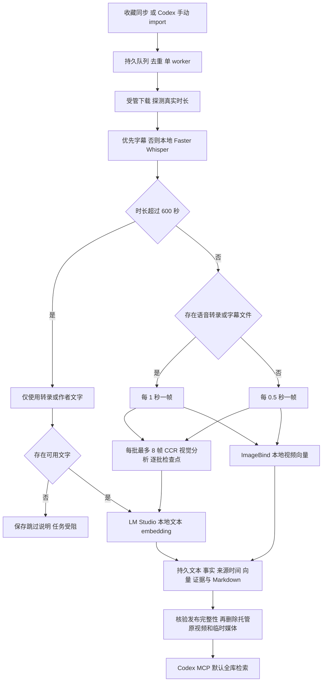

# 视频密集抽帧与 Markdown 知识输出

2026-10-04，America/Chicago。此次修改覆盖此前稀疏代表帧策略，采用用户最后确认的 **600 秒** 阈值。所有主题适用，累计处理时间预算仍为零（不限制）；收藏定时同步仍为每日芝加哥时间 07:00、18:00。

## 处理规则

| 输入 | 视觉策略 | 持久化内容 |
| --- | --- | --- |
| 时长 ≤600 秒，无语音、没有提供字幕文件 | 每 0.5 秒采样一帧，逐帧分析 | 分批小结、逐帧描述、支持的事实、向量、来源时间、少量证据图、Markdown |
| 时长 ≤600 秒，有本地语音转录或提供字幕文件 | 每 1 秒采样一帧，画面与转录共同分析 | 上述内容及原始转录；不伪造无时间戳字幕的语音对齐 |
| 时长 >600 秒 | 完全跳过视觉抽帧、VLM 图片调用和 ImageBind 视频编码 | 字幕/转录的文字知识；无语音时可使用明确标注来源的作者正文 |
| 时长 >600 秒，无语音、字幕及作者正文 | 不生成虚构知识，保存跳过说明 Markdown，任务受阻 | `NO_SPEECH_VISUAL_SKIPPED_NO_TEXT`；未成功发布，不立即删源，仍遵守失败媒体 TTL |

600 秒本身可以进行视觉分析。采样包含 0 秒，不包含终点：2 秒无语音视频采样 0、0.5、1、1.5 秒；恰好 600 秒为 1200 帧或 600 帧。这里的字幕指提交的字幕文件；只有烧录字幕而没有语音时，仍以 0.5 秒采样并由视觉模型读取画面文字。

“无语音”由无音轨或本地 Faster Whisper 没有检测到语音确定。网络错误、ASR 服务故障、无效字幕不会被伪装成无语音。有音轨但没有配置 ASR 时，仍明确要求转录；无音轨的视频无需加载 ASR 模型。

## 工作流

视觉分析参考 [HKUDS/VideoRAG 的分段画面描述及转录融合](https://github.com/HKUDS/VideoRAG/blob/c412a093a820ef7a0e0dda31076ed871136198b3/VideoRAG-algorithm/videorag/_videoutil/caption.py)，在本项目中适配为持久知识后端。未整体替换为上游应用，也不恢复其查询时重读原视频的路径。

## 实现与恢复

- 每个逻辑视频片段只进行一次密集帧解码；每批最多 8 帧，要求模型为每个输入帧返回非空描述。缺帧、重复索引或遗漏描述会阻止发布。
- 每个成功批次立即保存检查点。模型调用中断后复用兼容的已完成批次；重新解码临时帧不重复已保存的模型调用。旧稀疏视觉检查点不符合新覆盖要求，不会冒充密集处理完成。
- 原先固定 100 张图的限额无法覆盖 600 秒视频。现在根据计划帧数和批次数设置有限请求/图像额度，预留有限重试及历史用量，账本保留；没有无限自动重试。累计时间预算仍为零，网络请求仍保留断线超时。
- ImageBind 原有视频预处理和向量空间不变；0.5/1 秒是 VLM 图像分析的频率，与 ImageBind 的内部采样不同。文本通过 LM Studio 分块编码后聚合，避免密集描述被单次截断。
- `derived/JOB_ID/knowledge.md` 保存分批小结、可展开的逐帧描述、事实及 unknown/conflict 标记和证据图引用。`record.json` 保存处理策略、计划/实际帧数及结构化记录。
- 为遵守删源要求，不长期保存所有采样图。逐帧描述全部保存，每个片段最多保留两张证据图；其余候选帧、音轨和切片在成功发布后清理。截图数量不代表实际分析帧数。
- 未改动手写笔记、登录凭据和物理存储兼容分区。已经完成且已删除原视频的历史记录保持原有知识；此规则应用于新任务和未完成任务，不自动重新下载历史原视频。

## 验证

真实 CCR、ImageBind 和 LM Studio 调用的隔离合成视频验证见 [运行结果](dense-sampling-live-results.json)：2 秒无音轨视频分析 4 帧，2 秒带字幕视频分析 2 帧，601 秒视频分析 0 帧且没有视频向量。三条均完成数据库发布、Markdown 保存及托管原视频/工作目录清理。合成任务使用独立 library ID，不进入所有者收藏检索。

复现入口为 `examples/verify_dense_sampling.py`，依赖当前本地模型、路由器和数据库，不需要新增 API 或 Linux 密码。此验证证明链路和阈值，不代替真实收藏内容的中文事实质量验收。回归结果与部署快照见 [检查结果](dense-sampling-checks.json)。
