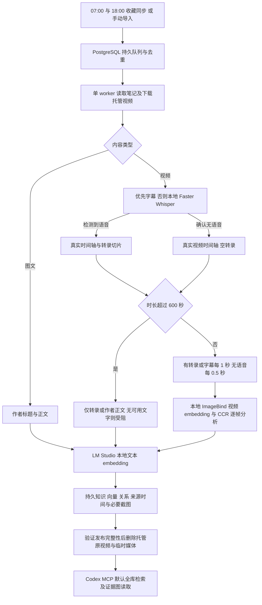

# 统一视频知识库与受阻任务修复

2026-10-04，America/Chicago。按用户最新要求，采用不强制分类的方案：所有主题资料进入统一逻辑知识库，查询默认覆盖全部内容。取消 cooking 分类和 collection 名称对视觉处理的限制；没有创建新业务类别，也没有改动已有索引代际或向量空间。

## 原来的十条受阻任务

下表保留取消时间预算前的诊断快照。随后用户已要求取消累计时间预算，两条时间预算任务已恢复，见文末更新。

原始清单采样于 13:16，修复后状态采样于 13:23。任务编号、原错误码、阶段和更新状态见 [机器可读清单](blocked-jobs-20261004.json)。

| 内容 | 确认的原受阻原因 | 修复后的状态 |
| --- | --- | --- |
| 这样做简单好吃入味 | 视觉阶段超过 600 秒预算；已有 4 个切片检查点 | 仍受阻，保留检查点和原预算 |
| 温莎公爵最喜欢，蒙巴顿每次必点的菜（戴安娜牛排） | 本地 ASR 没有检测到语音；旧流程直接停止 | 已完成，改用画面分析；5 个视觉片段、10 张截图，托管原视频已删除 |
| 两人三餐｜公瑾爆蛋 | 同上，无语音被旧流程阻断；作者正文已单独索引 | 已完成画面分析与删源 |
| 雪王冰城配方分享 | 正文与视频可读取，但标题字段为空；解析器误报笔记不可用 | 修复解析器后已完整入库与删源 |
| 滑蛋鸡排饭，巨下饭 | CCR 模型抽取请求失败；已有 1 个切片检查点 | 保留已用预算与检查点，正在继续抽取 |
| 老上海罗宋汤 | 无语音被旧流程阻断；作者正文已单独索引 | 重新排队，允许画面分析 |
| 大空心泡芙 | 标题字段为空，被解析器误报不可用 | 修复后真实读取成功，重新排队 |
| 社交场上的潜规则大合集 | 视觉阶段超过 600 秒预算；已有 11 个切片检查点 | 仍受阻，保留检查点和原预算 |
| 在家做麻辣拌 | 标题字段为空，被解析器误报不可用 | 修复后真实读取成功，重新排队 |
| 18 分钟创业必修课 | 标题字段为空，被解析器误报不可用 | 修复后真实读取成功，重新排队 |

四条来源错误原码均为 `XHS_LOGIN_EXPIRED_OR_NOTE_UNAVAILABLE`，这个泛化错误并不等于 Cookie 过期。真实 `/user/me` 调用确认登录有效，四条页面均包含目标笔记、视频和正文，只缺少独立标题。修复后逐条读取成功，验证记录见 [来源诊断](source-failure-diagnostics-20261004.json)。现在保留正文首行或笔记 ID 作为显示标题；裸 ID 占位对象、错误笔记 ID 和非可信媒体源仍被拒绝。

模型请求错误为 `CCR_REQUEST_FAILED`，发生于知识抽取阶段，并非本地 embedding 失败。旧记录不能进一步判断具体网络或 HTTP 原因，因此没有把它解释为缺少 API key。重试保留失败请求的累计预算，不无限重试。

## 当前流程



当前所有者配置已启用视觉。新安装配置仍需所有者显式启用 `visual_enabled`；这个权限控制与主题无关。提供无时间戳的纯文本字幕时仍保留未知时间精度，不凭空建立画面对齐。ASR 服务故障、缺失模型和无效字幕不会伪装为无语音成功。图文笔记当前没有图片 OCR。

`rag_search`、`evidence_get` 默认 `knowledge_base="all"`。导入和收藏状态入口也默认 `all`，写入现有默认存储分区。旧 key `cooking` 只是物理存储兼容标识，不判断内容是不是烹饪，也不影响视觉资格；历史 `tech`、`social-conduct` 内容均在默认搜索范围。显式分区搜索仍可用；图片读取继续校验所有者 library ID、完成状态、删源状态、受管路径及文件摘要。

没有迁移既有文件或重建向量。已有完整任务仍保持已发布状态，不自动重新下载已删原视频。新任务和待处理任务采用新策略；旧文本-only 检查点不能冒充已完成视觉处理。密集抽帧策略实施后，仅兼容新策略的视觉检查点可复用，原稀疏视觉检查点不能计为已覆盖全部帧。

## 验证与部署

- 普通测试：175 passed，12 skipped。新增覆盖默认全库搜索、无语音画面处理、不伪造转录、字幕优先、错误 ASR 不静默降级、缓存模态兼容、证据隔离、混合主题评测及无标题笔记解析。
- 显式真实 PostgreSQL 队列测试：4 passed，测试行已在临时 library 下清理，不调用模型或切换索引。
- 真实戴安娜牛排：`no_speech_visual_only`；5 个切片均有本地视频向量，共 10 张证据图；已完成发布与删源。
- 新 stdio MCP 连接：不传类别可以搜索全部三个历史分区，召回上述视频；不传类别可以取回实际图片，原视频和工作目录均不存在。见 [真实验证结果](unified-library-live-results.json)。
- 新 worker 显式处理 SIGINT/SIGTERM，使请求 ledger 的 finally 可以执行；实际停止得到 Result=success，重启后 worker active。
- 收藏定时器仍为每日 07:00、18:00，America/Chicago。服务入口已改为默认 all；timer active。
- Ruff、compileall、shell 语法和差异格式检查通过。原预算、失败媒体 TTL、登录凭据、索引空间及来源清理规则保留。

取消类别不等于真实质量全部验收。最终检索评测现使用至少 10 个不同来源和 60 个人工核实问题，仍验证来源去重与删源状态；人工质量关口没有因移除 cooking 限制而自动通过。

## 使用入口

新开 Codex 会话加载更新后的 MCP 定义，直接说“搜索我的知识库，关于某个问题有哪些依据”，无需指定类别。手动提交与自动收藏同步同时保留。

```bash
# 全库检索
bash examples/video_runtime.sh cli search '我的问题'

# 手动读取收藏并去重入队
bash examples/video_runtime.sh cli import-favorites

# 查询具体任务
bash examples/video_runtime.sh cli status JOB_ID

# 查看每日同步的调度与结果
bash examples/video_runtime.sh favorites-nightly-status
```


## 取消累计时间预算

用户随后明确要求取消时间预算。新配置默认和当前所有者 profile 均为 `visual_budget_seconds=0`，表示无限制；已有请求的累计耗时继续记录，重启后不会因旧耗时再次触发时间停止。可选的正数预算仅作为显式配置能力保留，当前没有启用。

两条原时间预算任务已使用 `retry --visual-seconds 0` 恢复同一个任务编号，恢复前分别已有 4 个和 11 个切片检查点，并提升优先级继续后台处理。ledger 不清零，不重新下载已有原视频；检查点通过缓存身份校验后复用，不兼容的旧切片重新提取。单次网络请求仍有 600 秒断线超时，请求数量/图像数量限制仍有效。

验证：184 项普通测试通过，13 项需要额外环境的测试跳过；5 项真实 PostgreSQL 队列测试另行通过。覆盖零值与默认无限制、旧累计耗时超过阈值后的续跑、网络请求超时独立于累计预算、失败请求用量保留、显式有限预算兼容及数据库重试。worker 更新后 active，每日 07:00/18:00 定时器 active。完整发布仍由后台任务继续完成，不能把恢复入队计为成功入库。见 [取消时间预算验证记录](time-budget-removal-results.json)。

## 后续密集抽帧更新

用户随后确定无语音每 0.5 秒、有语音/字幕每 1 秒，超过 600 秒跳过所有视觉处理。已实现逐帧覆盖检查、分批恢复与 Markdown 输出；图像限额改为按计划帧数设置有限额度。详情及验证见 [密集抽帧修改记录](dense-sampling-update.md)，上述受阻表保留原诊断时刻的状态。
